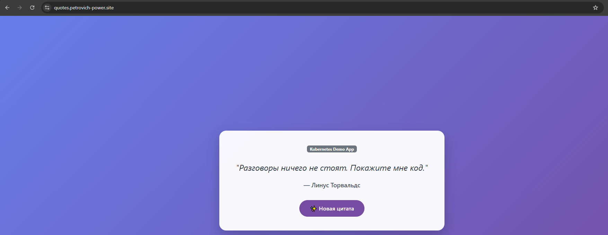

Автоматизированный комплекс развертывания облачной инфраструктуры в Yandex Cloud, Kubernetes-кластера, платформенных DevOps-сервисов (GitLab, Nexus, Argo CD, Observability Stack) и автоматического деплоя микросервисного приложения **Quotes** (Frontend + Backend).

---

## 📐 Архитектура системы

Ниже представлена общая схема взаимодействия компонентов системы:

```text
                               +------------------------+
                               |     Разработчик /      |
                               |    Администратор       |
                               +-----------+------------+
                                           |
                                   1. ./deploy.sh
                                           |
                                           v
                               +------------------------+
                               |    Yandex Cloud API    |
                               +-----------+------------+
                                           |
                                  Terraform (ВМ & Сети)
                                           |
                                           v
+-----------------------------------------------------------------------------------+
|  Публичный IP (Hoster.by A-records -> *.petrovich-power.site)                     |
|                                                                                   |
|  +-----------------------------------------------------------------------------+  |
|  |  Bastion Host (Nginx Reverse Proxy + SSL Let's Encrypt)                   |  |
|  +----+-----------------+--------------------+------------------+--------------+  |
|       |                 |                    |                  |                 |
|       | :443            | :443               | :443             | :443            |
|       v                 v                    v                  v                 |
|  +---------+     +------------+     +------------------+  +---------------+       |
|  | GitLab  |     |   Nexus    |     |  K8s NodePorts   |  |   PostgreSQL  |       |
|  | Server  |     | (Registry  |     | (ArgoCD, Quotes, |  |   (External)  |       |
|  | (Docker)|     |  & Helm)   |     |  Grafana, Prom)  |  +---------------+       |
|  +----+----+     +-----+------+     +--------+---------+                          |
|       |                ^                     ^                                    |
|       | (Runner Pod)   | (Push Image/Helm)   | (Pull & Sync Manifests)            |
|       +----------------+                     |                                    |
|       |                                      |                                    |
|       v                                      v                                    |
|  +-----------------------------------------------------------------------------+  |
|  |                         Kubernetes Cluster (Kubeadm)                        |  |
|  |                                                                             |  |
|  |  [Namespaces]                                                               |  |
|  |   ├── gitlab-runner  ---> GitLab Runner (Сборка с Kaniko)                    |  |
|  |   ├── argocd         ---> Argo CD + Argo CD Image Updater                   |  |
|  |   ├── monitoring     ---> Prometheus, Grafana, Loki, Promtail               |  |
|  |   ├── ingress-nginx  ---> Ingress Controller                               |  |
|  |   └── default        ---> Quote Backend (Pod) & Quote Frontend (Pod)        |  |
|  +-----------------------------------------------------------------------------+  |
+-----------------------------------------------------------------------------------+


Успешный результат запуска приложения:

